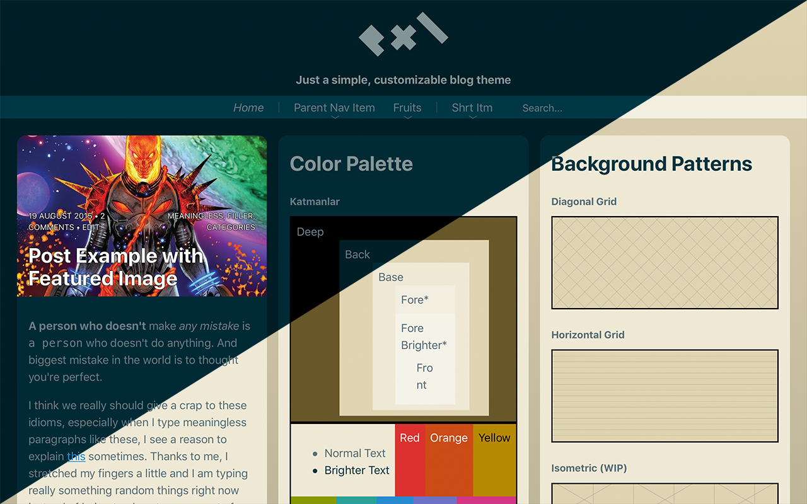

# pxl
> Just a simple, customizable blog theme.



[**Demo**](https://egeesin.com/pxl-preview)

## Features

- Mobile-first responsive layout.
- (Almost) every element has multiple designs to serve content in multiple ways.
- Scalable and maintainable codebase written with several naming conventions and methodologies like OOCSS, BEVM in mind.
	- Opinionated styles as an option.
- No CSS frameworks used.
	- Only homemade components.
- Improved legibility with vertical rhythm and modular scale by default.
- Written with modern specifications like custom properties, mediaMatch...
- Supports every web browser except all versions of Internet Explorer, Opera Mini, and other browsers that has global usage lesser than 0.33%
	- [browserl.ist](http://browserl.ist/?q=%3E0.33%25%2C+not+ie+11%2C+not+op_mini+all)
- System font bundle as fallback.
- [Solarized](https://ethanschoonover.com/solarized/) as default theme colors, and many other options like Monokai, Atom One...
- [Touch-friendly](https://osvaldas.info/drop-down-navigation-responsive-and-touch-friendly) dropdown menu.
- Everything is automated with [Gulp.js](https://gulpjs.com/).

## Build

**Dependencies:** git, npm, [gulp](https://gulpjs.com/docs/en/getting-started/quick-start)

Open a terminal emulator (/Applications/Terminal.app in macOS) and execute commands below.

```sh
# Clone the repository to your local machine
git clone https://github.com/egeesin/pxl

# Change directory
cd pxl

# Install Gulp plugins to local directory.
npm install -D

# Generate
gulp build
```


## Wiki

To using the theme with full potential and to keep maintainability, this guideline will help your development.

At this time, guideline might not cover everything in the theme but starting with crucial/confusing parts, everything will be included step by step.

### Browser Support

The intention is to support modern browsers to use newest tools. Supporting legacy browsers isn't main focus yet.

At this time,

- All IE versions, Opera Mini unsupported,
- Edge is partially supported,
- All other modern browsers has bigger than 0.33% usage is fully supported.


### Methodology/Class Namings

Before explanation, if you haven't heard of any CSS methodologies or naming conventions, it's useful to know [BEM](http://getbem.com/naming/), [OOCSS](https://www.slideshare.net/stubbornella/object-oriented-css), [BEVM](https://www.slideshare.net/Jyaasa/bevm-blockelementvariation-modifier) and [Harry Roberts' namespaces](https://csswizardry.com/2015/03/more-transparent-ui-code-with-namespaces/) first.

In this theme, intention is to combine a few of naming conventions to improve legibility and maintainability. Word groups are written with  camelCase instead of comma-separated in order to not confused between seperation of block-element-modifier and word group.

Modifier and variant classes are separated from block and element classes. If you familiar with UNIX command line this will probably help.

```
// Not like this
block block--modifier
	block__element block__element--modifier

// But this
block --modifier
	block__element --modifier
block -variant
```

To connect modifier with a block(in CSS): ``.block.-modifier``
**Note:** Classes begins with a tick or an underscore, doesn't support in IE8 or older browsers.


### Typography
Every width, height, padding, margin unit are em-based. Heading elements are proportionally sized by modular scale and each typographic element margin resized to fit vertical rhythm. Thanks to CSS variables, everything is reconfigurable. Default font is based on user's operating system.

### Concepts
Most of them has pretty simple purposes. As far as it's simple, all of them can be reusable, some of them can be placed recursively.

#### Card | ``c-card``
First thing comes in mind when placing content, that would be a card. It's really similar concept that mostly visually seen in Material Design, iOS App Store. Cards are portable and contains any type of content. Height of a card must be formed by included content.

Cards must not look like it's part of element itself but children of element. That's the main difference between frames and cards.

#### Frame | ``c-frame``
This concept can host full-sized content like jumbotron, videos. It must looks like **part** of element. Visually, frames must contain, not being contained. Width of a frame is also width of viewport.

#### Grid | ``o-grid``
This grid system based on [csswizardry-grids](https://github.com/csswizardry/csswizardry-grids).

#### Navigation | ``o-nav``
A navigation menu must let reader navigate through site or category. It doesn't have be limited to be a navigation bar. This concept can involve Table of Content lists, site map, blog tags and other relevant things too.

##### Tree View | ``o-nav -viewTree``
Tree view is the most simple form of a navigation concept.

##### Dropdown View | ``o-nav -viewDropdown``
A navigation bar with only first-level shown. Deeper levels displayed by hovering cursor on its parent (in mobile, by tapping its parent). It's useful to make complex navigations look compact.

With ``-collapsible`` option, first-level of navigation bar minimizes to toggle (``c-toggleTrigger``) button. Highly recommended for handheld devices, if you have complex menu items.

Dropdown navigation placement can also changed by ``-positionTop`` and ``-positionSide``

**Note:** All functions except arrows works without JavaScript.

#### Perfectly Full-Sized, Fixed Background Image
Originally, to make background image viewable as much as possible no matter how window resized, there's an independent element with 'c-background -viewFullSizeFixed' classes. It's necessary if you want your background image look fixed in iOS. ([Source](https://css-tricks.com/perfect-full-page-background-image/))

### Colors
The default color theme is based on Solarized theme which terminal users is familiar with because of different tones, harmonical colors and dark theme option. But users who doesn't prefer Solarized can choose other themes like Monokai, Seti, Night Owl, Atom One etc. or change color variables.

### Media Breakpoints

Unlike most other works breakpoints are not grouped by device/model names but [human ergonomics](https://twitter.com/lukew/status/273453112902172672).

## Known Issues

- Long sub-menus are unreachable in short screens.
- Some design inconsistencies in MS Edge.
- Jekyll Gulp task doesn't working.

## Roadmap

- [] Improving documentation, grammar etc.
- [] Contribution info
- [] Jekyll & WordPress theme support
- [] Dynamic dark theme script
- [] Custom icon set
- [] [Pywal](https://github.com/dylanaraps/pywal) support
- [] Legacy support

## Contribution
Issues and PRs are welcomed!

## License
Theme is under GNU GPL 2.0 license.
